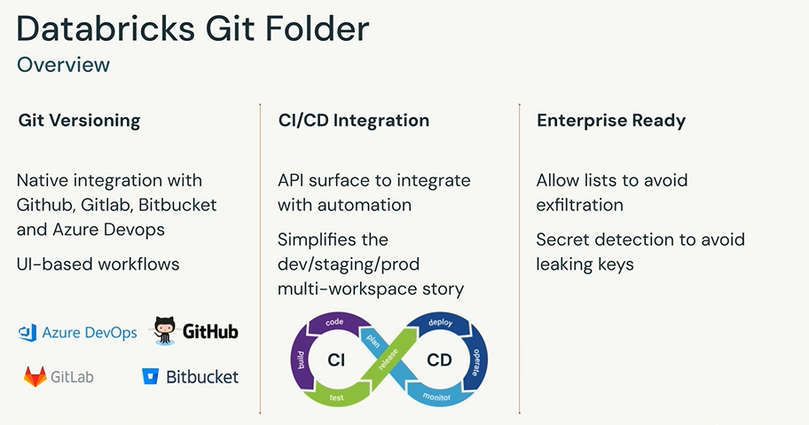
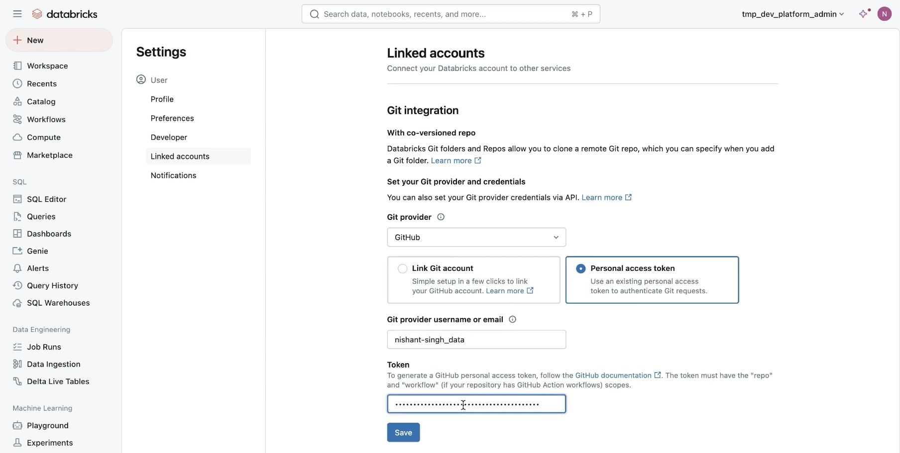
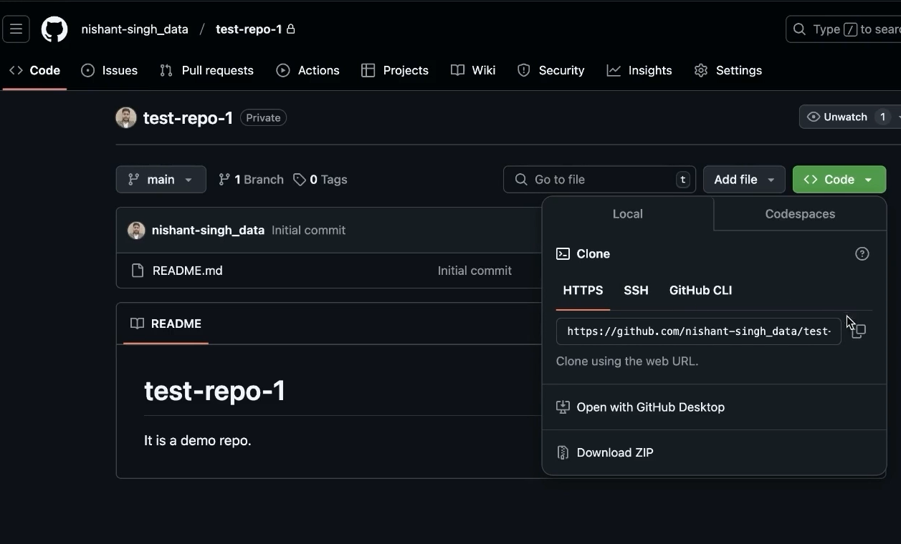

CI/CD Administration in Databricks

 ## Demo: Setting up Databricks Git Folders

 setting the git on databricks:
1. Click on databricks logo
1. Click on user menu (top left conner) 
1. Follow on: Linked accounts > Git provider > Personal access token > git username > token > save

1. Select the HTTPS url of your folder

1. Workspace > Create > Git folder

1. URL > Git provider > Git folder name > Create Git Folder

...

In granting access to Databricks Git Folder, keep in mind that permissions apply to the entire Databricks Git Folder.

* View: provides read-only access to Databricks Git Folder

* Run: View + run

* Edit: View + run + modify existing files

* Manage: Provides complete administrative capabilities over Databricks Git Folder

Setting permissions on Git Folder:

