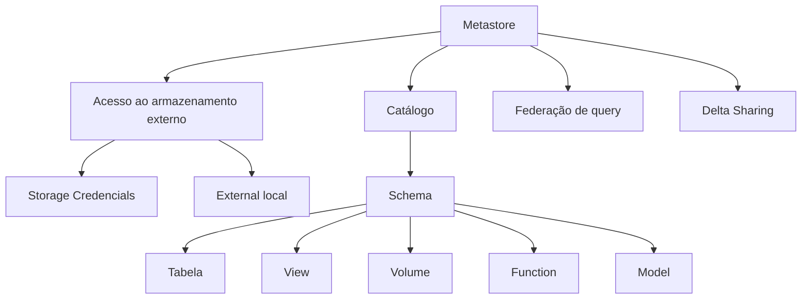

# Data Governance Overview

80% das organizações que buscam esclar negócios digitais irão fracassar porque não adotam uma abordagem moderna para governaça de dados e analítica.


Data Governace refer to the process of managing the availability, usability, integraty and data security.

* Access control
* Data Access auditory (how and when data is been used)
* Data Lineage (the journey that data takes from origins, sources, trhout consuntions )
* Data descovery (inventory)


unitycatalog.io

**Lakehouse Federation** fornece um único ponto de acesso aos dados externos:
* Foreing catalog
* Connextion

**Delta Sharing** is an open protocol design for secure data sharing across organizations.


**Unity Catalog** é uma construção que representa o metadata, ou seja, informações sobre os objetos e sua lista de acessos.

Hive => para cada workspace.


# 1 - Populating the Metasore (lab)

O Unity Catalog introduz o conceito de um **catálogo** na hierarquia, que fornece outra camada de contenção acima da camada de esquema. Isso fornece uma nova maneira para as organizações segregarem seus dados e pode ser útil em muitos casos de uso. Por exemplo:

* Separar dados relacionados a unidades de negócios dentro da sua organização (vendas, marketing, recursos humanos, etc.)
* Satisfazer os requisitos de SDLC (desenvolvimento, teste, produção, etc.)
* Estabelecer ambientes de teste contendo conjuntos de dados temporários para uso interno

Podemos aproveitar as instruções **`USE`** para selecionar um catálogo ou esquema default para tornar nossas consultas mais fáceis de escrever e ler:

```sql
USE CATALOG mycatalog;
USE SCHEMA myschema;
```

```python
%python
# Criar um novo catálogo
display(spark.sql(f"CREATE CATALOG IF NOT EXISTS {clean_username}"))
```
```sql
-- Verificar o catálogo atual
SELECT current_catalog()

-- Criar um novo esquema
CREATE SCHEMA IF NOT EXISTS example;

-- Tornar o esquema recém-criado o default
USE SCHEMA example;

-- Verificar o esquema default atual
SELECT current_schema()
```
### Criar uma Tabela Gerenciada

* Só precisamos especificar o nome da tabela ao criar a tabela. Não precisamos especificar o catálogo ou esquema contendo porque já selecionamos os defaults anteriormente com instruções **`USE`**.
* Esta será uma tabela gerenciada, pois não estamos especificando um **`LOCAL`**.
* Como é uma tabela gerenciada, também será uma tabela Delta.

```sql
-- Criar a tabela prata
CREATE OR REPLACE TABLE silver
(
  device_id  INT,
  mrn        STRING,
  name       STRING,
  time       TIMESTAMP,
  heartrate  DOUBLE
);
```
### Criando e Gerenciando Visualizações

Vamos criar uma visualização *ouro* que apresenta uma visão processada dos dados da tabela *prata* calculando a média dos dados de frequência cardíaca por paciente numa base diária.

```sql
-- Criar uma visão de ouro
CREATE OR REPLACE VIEW gold AS (
  SELECT mrn, name, MEAN(heartrate) avg_heartrate, DATE_TRUNC("DD", time) date
  FROM silver
  GROUP BY mrn, name, DATE_TRUNC("DD", time));
-- Visualizar as linhas dentro da visão de ouro
SELECT * FROM gold
```
### Criando e Gerenciando Funções Definidas pelo Usuário
```sql
-- Criar uma função personalizada para mascarar um valor de string
CREATE OR REPLACE FUNCTION dbacademy_mask(x STRING)
  RETURNS STRING
  RETURN CONCAT(LEFT(x, 2) , REPEAT("*", LENGTH(x) - 4), RIGHT(x, 2))
```
### Apagando Catalogs e Schemas
*  Clique no nome do esquema para abrir sua página de detalhes. No canto superior direito, clique no menu "kebab" e selecione Excluir para excluir o esquema. Clique no aviso para aceitar.


```sql
-- Apagando o schema
DROP SCHEMA default CASCADE
```

Há guias ao longo da parte superior onde podemos visualizar e gerenciar metadados sobre esta tabela:
* Visão geral -- À direita, temos informações sobre a tabela, tags, sua descrição e podemos adicionar uma função de filtragem de linhas se desejarmos. Falaremos sobre isso numa lição futura. À esquerda, obtemos informações sobre cada coluna da tabela
* Dados de exemplo -- Esta guia nos dá as primeiras linhas da tabela, para que possamos ver os dados contidos na tabela
* Detalhes -- Obtemos as mesmas informações aqui que obteríamos executando **`DESCRIBE EXTENDED silver`**
* Permissões -- A interface do usuário nos dá a capacidade de gerenciar permissões de tabela. Podemos **`CONCEDER`** e **`REVOGAR`** permissões aqui. Falaremos sobre como fazer isso programaticamente numa lição futura
* Histórico -- O log de transações do Delta Lake está nesta guia. Podemos obter isso programaticamente executando **`DESCRIBE HISTORY silver`**
* Linhagem -- É muito útil ver a linhagem da tabela. Clique em **`Ver gráfico de linhagem`** para ver tanto nossa tabela *prata* quanto a visão *ouro*. Observe que a visão obtém seus dados da tabela *prata*. Clique no "X" no canto superior direito para fechar a janela
* Insights -- A Plataforma de Inteligência de Dados do Databricks fornece esses insights, para que possamos ver como nosso objeto de dados está sendo usado.
* Qualidade -- Esta guia nos dá a capacidade de monitorar esta tabela para qualidade de dados. Vamos falar mais sobre isso em seguida

### Monitoramento do Databricks Lakehouse
O Monitoramento do Databricks Lakehouse permite monitorar propriedades estatísticas e a qualidade dos dados numa tabela específica ou em todas as tabelas da sua conta. Para monitorar uma tabela no Databricks, você cria um monitor anexado à tabela.

Podemos criar um monitor usando o Catalog Explorer ou a API. Vamos usar o Catalog Explorer para criar um monitor anexado à nossa tabela **`prata`**.

Se você ainda não estiver na guia **`Qualidade`**, clique nela. Para criar um novo monitor, clique em **`Iniciar`**. Abaixe o **`Tipo de perfil`** e selecione **`Snapshot`**. Abaixe **`Opções avançadas`** e selecione **`Atualizar manualmente`** para o tipo de atualização.

Clique em **`Criar`**.

**Nota:** A criação de um monitor pode levar um ou dois minutos. Aguarde até que o monitor seja totalmente criado antes de executar a próxima célula.

# Organiztion and Access Patterns


Worksparce has access to catalog..

## Exemplo


## Melhores práticas
Crie os catálogos mínimos necessários para atender aos requisitos de isolamento e propriedade da sua equipe.
* Catálogos separados por responsabilidades
    - Ambiente de desenvolvimento (dev/qa/prod)
    - Unidade de negócios (TI, financças, Vendas, ...)
    - Compartilhamento / Bancos de Dados Estrangeiros

* Use a Workspace-Catalog Binding quando necessário

### Clusters e depósitos de dados com Unity Catalog


* Use Clusters Compartilhados como seu processamento default e reverta para modo de usuário único em caso de limitações.
* Desenvolva e implante usando o mesmo modo de acesso.


* Metastore de região única para todos os escopos de SDLC e unidade de negócios
* Use o Campartilhamento Delta Databricks-to-Databricks entre fornecedores de Cloud + regiões

### Lakehouse Monitoring


# Atualizando Tabelas para o Unity Catalog (LAB3)

```sql
-- Mostrar a lista de tabelas dentro do esquema personalizado
SHOW TABLES FROM example;

-- Mostrar a lista de visualizações dentro do esquema personalizado
SHOW VIEWS FROM example;
```


```python
--  Mostrar as primeiras 10 linhas da tabela de filmes que reside no esquema específico do usuário do metastore do Hive
display(spark.sql(f"SELECT * FROM hive_metastore.{clean_username}.movies LIMIT 10"))
```

```python
# Descreva as propriedades da tabela "movies" no esquema específico do usuário do metastore do Hive usando a opção estendida para obter mais detalhes.
display(spark.sql(f"DESCRIBE EXTENDED hive_metastore.{clean_username}.movies"))
```
...

Detailed Table Information

Catalog	hive_metastore
Database	labuser8864408_1736257527vocareumcom
Table	movies
Created Time	Tue Jan 07 13:55:20 UTC 2025
Last Access	UNKNOWN
Created By	Spark 3.5.0
Type	MANAGED
Location	**dbfs:/**user/hive/warehouse/labuser8864408_1736257527vocareumcom.db/movies
Provider	**delta**
Owner	root
Is_managed_location	true
Table Properties	[delta.enableDeletionVectors=true,delta.feature.deletionVectors=supported,delta.minReaderVersion=3,delta.minWriterVersion=7]

## 1. Copiando os dados e os metadados
```python
#  Clone profundo a tabela "movies" do esquema específico do usuário do metastore do Hive para criar uma nova tabela chamada "movies_clone" no catálogo específico do usuário do esquema de exemplo.
spark.sql(f"CREATE OR REPLACE TABLE {clean_username}.example.movies_clone CLONE hive_metastore.{clean_username}.movies")
```

## 2. Copiando somente os dados (sem cópia dos metadados legado) - **CTA**
```python
# Copie a tabela "movies" do esquema específico do usuário do metastore do Hive para criar "movies_ctas" no esquema de exemplo do catálogo específico do usuário usando CTAS (Criar Tabela Como Seleção)
spark.sql(f"""CREATE OR REPLACE TABLE {clean_username}.example.movies_ctas
  AS SELECT * FROM hive_metastore.{clean_username}.movies""")
```

## 3. Copiando apenas os metadados

As duas abordagens anteriores envolvem mover os dados para o metastore do Unity Catalog. No entanto, isso pode ser proibitivo em alguns casos como:
* A localização dos dados é ditada por um requisito interno ou regulatório de algum tipo
* Não é possível alterar o formato dos dados para Delta
* Os escritores externos devem ser capazes de modificar os dados
* Evitar o tempo e/ou o custo de mover grandes conjuntos de dados

Observe as seguintes restrições para essa abordagem:

* A tabela de origem deve ser uma tabela externa
* Deve haver uma credencial de armazenamento que faça referência ao contêiner de armazenamento onde residem os dados da tabela de origem

```python
# Execute uma operação SYNC com a opção DRY RUN na tabela "test_external" do esquema específico do usuário do metastore do Hive para criar a mesma tabela no esquema específico do usuário do catálogo atual.
display(spark.sql(f"""SYNC TABLE {clean_username}.example.test_external FROM hive_metastore.{clean_username}.test_external DRY RUN"""))

```

2.2.2 Usando o Data Explorer

Vamos tentar atualizar a tabela usando a interface do usuário do Catalog Explorer.

1. Abra o **Catalog Explorer**.
1. Selecione o catálogo **hive_metastore**, em seguida, selecione o esquema que contém a tabela de origem.
1. Selecione a tabela **movies** (pode ser qualquer tabela disponível).
1. Clique em **Atualizar**.
1. Selecione o catálogo e o esquema de destino. Aqui, selecione o seu _**catálogo atual**_ e o esquema personalizado **example** que foi criado pela configuração da sala de aula.
1. Para este exemplo, vamos deixar o proprietário definido como o default (seu nome de usuário) e clique em **Próximo**.
1. A partir daqui, você pode executar a atualização ou abrir um notebook contendo as operações de atualização que você pode executar interativamente. No entanto, para o propósito do exercício, você não precisa executar a atualização.


# Security and Administration in Unity Catalog


# Databricks Marketplace Overview

Is an open marketplace for sharing 
* Data
* Notebooks
* ML models
* Analytics
* Solutions Accelarators (???)

# Privileges in Unity Catalog


# Controle de acesso a dados (LAB 4)

### 2.2 Privilégios Herdados

Os objetos seguráveis no Unity Catalog são hierárquicos e os privilégios são herdados para baixo. Usar essa propriedade facilita a configuração de regras de acesso default para seus dados.

```phyton
-- acesso generalista...
spark.sql(f"GRANT USE CATALOG, USE SCHEMA, SELECT ON CATALOG {clean_username} TO `account users`")
```
```python
-- Revoke
spark.sql(f"REVOKE USE CATALOG,USE SCHEMA,SELECT ON CATALOG {clean_username} FROM `account users`")
```

```python
spark.sql(f"GRANT USE CATALOG ON CATALOG {clean_username} TO `account users`;")
spark.sql(f"GRANT USE SCHEMA ON SCHEMA {clean_username}.example TO `account users`;")
spark.sql(f"GRANT SELECT ON VIEW {clean_username}.example.gold TO `account users`")
```

## Mascaramento

```sql
-- Criar uma Função para Realizar Mascaramento de Colunas
CREATE FUNCTION mrn_mask(mrn STRING)
  RETURN CASE WHEN is_member('metastore_admins') THEN mrn ELSE 'REDACTED' END;
-- Alterar a Tabela para Aplicar a Máscara
ALTER TABLE silver ALTER COLUMN mrn SET MASK mrn_mask;

-- Retirando a máscara:
ALTER TABLE silver ALTER COLUMN mrn DROP MASK;

-- Excluindo a função:
DROP FUNCTION IF EXISTS mrn_mask;
```

## Criar uma Função para Realizar Filtragem de Linhas

```sql
CREATE FUNCTION device_filter(device_id INT)
RETURN IF(IS_ACCOUNT_GROUP_MEMBER('admin'), true, device_id < 30);
```

```sql
ALTER TABLE silver SET ROW FILTER device_filter ON (device_id);
```

Retirando o filtro de linha:
```sql
ALTER TABLE silver DROP ROW FILTER;
```

## Protegendo Colunas e Linhas com Visualizações Dinâmicas

As visualizações dinâmicas fornecem a capacidade de realizar controle de acesso refinado de colunas e linhas dentro de uma tabela, condicionalmente ao principal que executa a consulta. As visualizações dinâmicas são uma extensão das visualizações defaults que nos permitem fazer coisas como:
* obscurecer parcialmente os valores das colunas ou redigi-los inteiramente
* omitir linhas com base em critérios específicos

O controle de acesso com visualizações dinâmicas é alcançado por meio do uso de funções dentro da definição da visualização. Essas funções incluem:
* **`current_user()`**: retorna o endereço de e-mail do usuário que consulta a visualização
* **`is_account_group_member()`**: retorna TRUE se o usuário que consulta a visualização for membro do grupo especificado
* **`is_member()`**: retorna TRUE se o usuário que consulta a visualização for membro do grupo local do workspace especificado

Nota: O Databricks geralmente aconselha contra o uso da função **`is_member()`** em produção, pois ela referencia grupos locais do workspace e, portanto, introduz uma dependência do workspace num metastore que potencialmente abrange vários workspaces.

### Ocultando colunas
```sql

CREATE OR REPLACE VIEW gold AS
SELECT
  CASE WHEN
    is_account_group_member('metastore_admins') THEN mrn 
    ELSE 'REDACTED'
  END AS mrn,
  CASE WHEN
    is_account_group_member('metastore_admins') THEN name
    ELSE 'REDACTED'
  END AS name,
  MEAN(heartrate) avg_heartrate,
  DATE_TRUNC("DD", time) date
  FROM silver
  GROUP BY mrn, name, DATE_TRUNC("DD", time);


-- Grant
GRANT SELECT ON VIEW gold TO `account users`
```

```sql
CREATE OR REPLACE VIEW gold AS
SELECT
  CASE WHEN
    is_account_group_member('metastore_admins') THEN mrn
    ELSE dbacademy_mask(mrn)
  END AS mrn,
  time,
  device_id,
  heartrate
FROM silver
WHERE
  CASE WHEN
    is_account_group_member('metastore_admins') THEN TRUE
    ELSE device_id < 30
  END;

-- Reemitir a concessão --
GRANT SELECT ON VIEW gold TO `account users`
```


### Ocultando linhas
```sql
CREATE OR REPLACE VIEW gold AS
SELECT
  mrn,
  time,
  device_id,
  heartrate
FROM silver
WHERE
  CASE WHEN
    is_account_group_member('metastore_admins') THEN TRUE
    ELSE device_id < 30
  END;
```

```sql
-- Re-issue the grant --
GRANT SELECT ON VIEW gold TO `account users`
```

# Fine-Grained Access Control

row and columns controls. 2 aproches:
* Row and collumns security
Geralmente mais performática e mais fácil de manter
* Dinamic view
  - Cada regra uma view => Mais difícil de manter
  - Somente leitura


